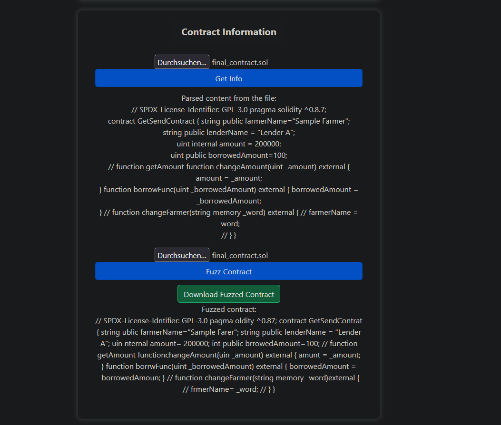
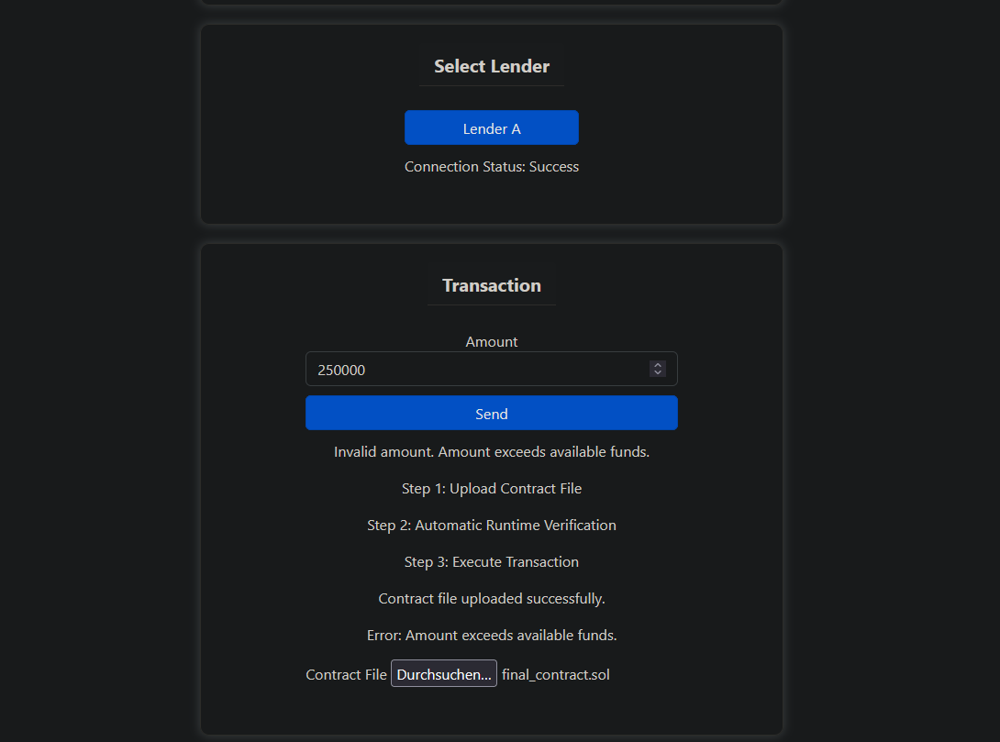
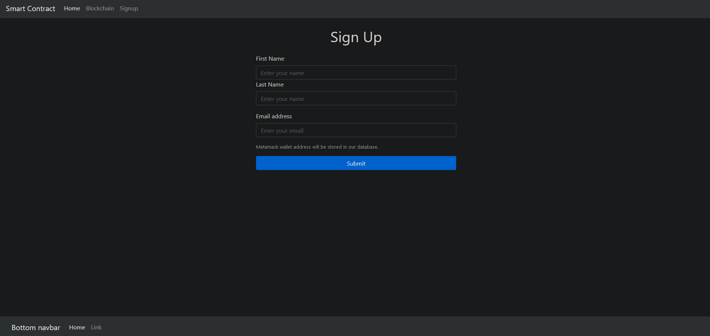
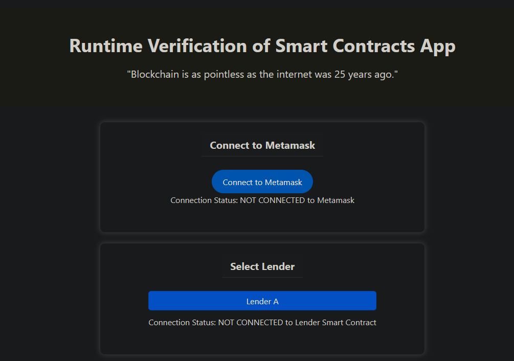
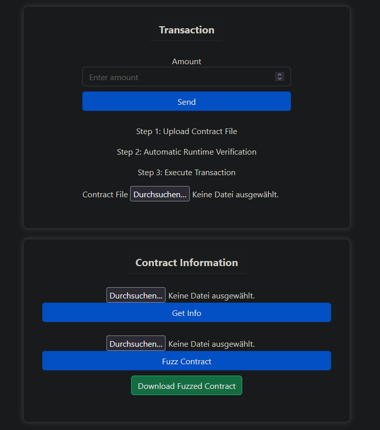
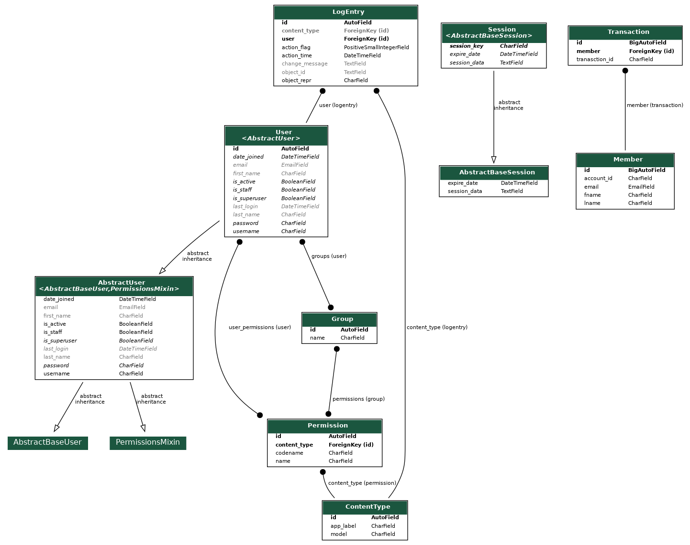
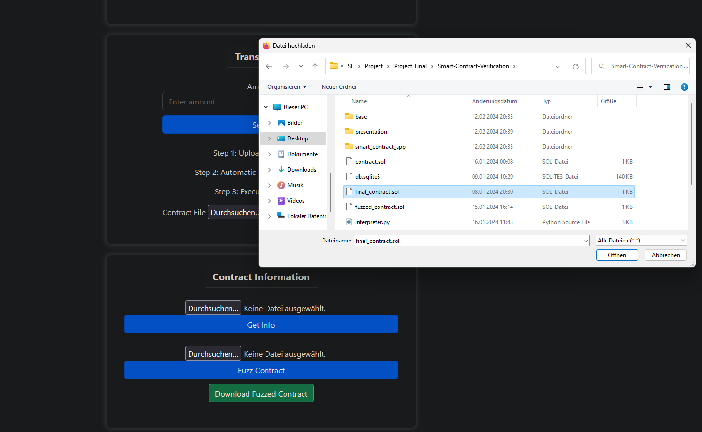
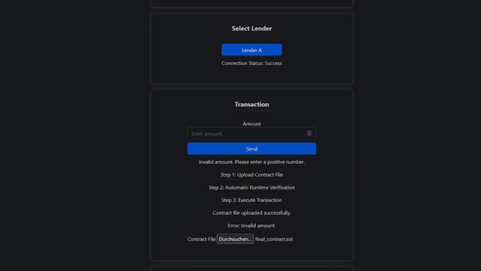

# Solidity Smart Contract Simulator

This project is a web simulator for testing Solidity smart contracts. It verifies the correctness of the code, matches amounts, and ensures names in the contract correspond to the correct lender. The simulator also includes a database using SQLite3 to store user credentials and the ability to connect to MetaMask wallet and bind its address to a user's account.

## Technologies Used

- **Backend**: Django
- **Frontend**: HTML, CSS, JavaScript
- **Database**: SQLite3
- **Smart Contract Language**: Solidity

## Features

- Verify Solidity smart contracts for correct code and matching amounts.
- Ensure names in contracts correspond to the correct lender.
- Database for storing user credentials.
- Connection to MetaMask wallet.
- Simulation of contract transfers.
- Display of contract contents and errors.

## Screenshots and GIFs

### Contract Details


### Exceed Amount Error


### Signup Page


### Smart Contract 1


### Smart Contract 2


### Models Diagram


### Select File


### Smart Contract Simulation (GIF)


## Cloning

To get a local copy of this project up and running on your machine, simply clone this repository using Git:

```sh
git clone https://github.com/AndreiE91/Smart-Contract-Verification.git
cd Smart-Contract-Verification
```

Open the project in VS Code or any editor of your choice.

## Usage

1. Clone the repository.
2. Install dependencies using `pip install -r requirements.txt`.
3. Run the Django server using `python manage.py runserver`.

## Contributing

Contributions are welcome! Feel free to open issues or submit pull requests.

